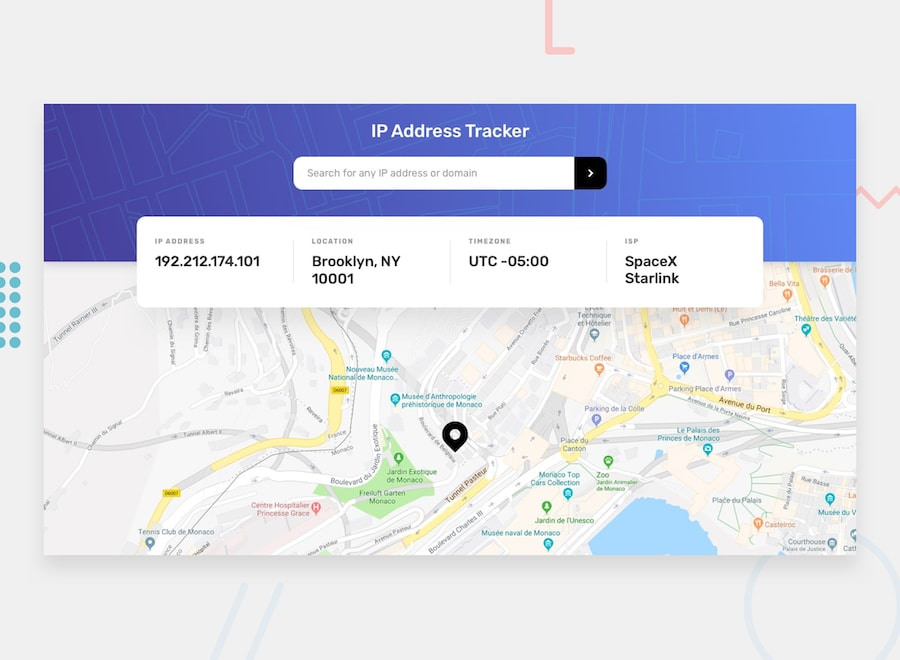

# Frontend Mentor - IP address tracker

[IP address tracker](https://www.frontendmentor.io/challenges/ip-address-tracker-I8-0yYAH0)

## Table of contents

- [Overview](#overview)
  - [The challenge](#the-challenge)
  - [Links](#links)
- [Process](#process)
  - [Built with](#built-with)
  - [What I learned](#what-i-learned)
  - [Useful resources](#useful-resources)

## Overview

### The challenge

Users should be able to:

- See their own IP address on the map on the initial page load
- Search for any IP addresses or domains and see the key information and location
- View the optimal layout for each page depending on their device's screen size
- See hover states for all interactive elements on the page

## Process

### Built with

- [Svelte 5](https://svelte.dev/)
- [TypeScript](https://www.typescriptlang.org/)
- [Tailwind CSS v4](https://tailwindcss.com/)
- [Vite](https://vitejs.dev/)
- [LeafletJS](https://leafletjs.com/)
- [ip-api.com](https://ip-api.com/)

### What I learned

- Integrate LeafletJS with Svelte using `onMount` and `$effect` for reactive map updates
- Using the `Intl.DateTimeFormat` API to convert IANA timezone names to UTC offset strings
- Setting up Tailwind CSS v4 with its new Vite plugin and CSS-based configuration

### Useful resources

- [LeafletJS Docs](https://leafletjs.com/reference.html)
- [ip-api.com Docs](https://ip-api.com/docs/api:json)
- [Svelte 5 Runes](https://svelte.dev/docs/svelte/what-are-runes)
